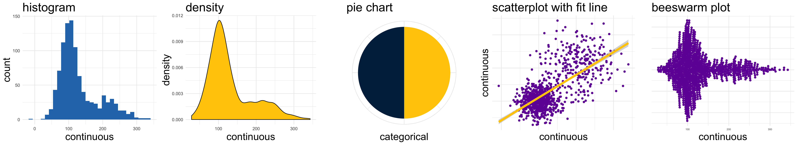
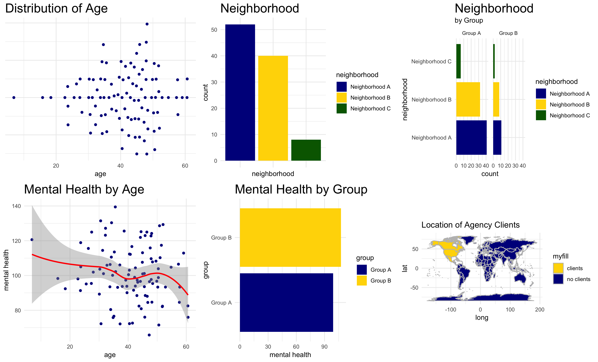
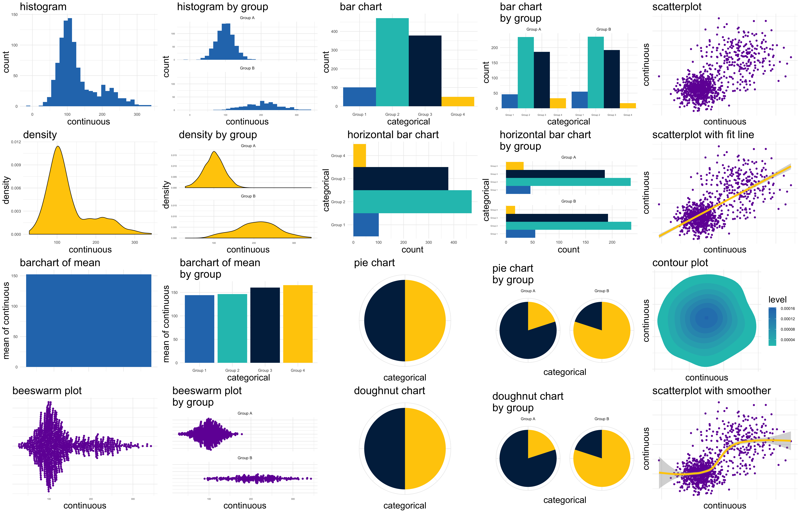
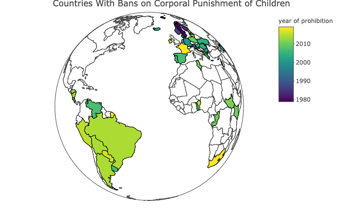

```{r setup, include=FALSE}

knitr::opts_chunk$set(echo = FALSE)

```

```{r}



```

# Course Description

In an era of evidence based practice, community workers, advocates, and evaluators will likely find that they need to interpret and visualize data from a wide variety of sources. Understanding, interpreting and visualizing data (including some basic coding) can make the difference in successfully or unsuccessfully advocating for communities, clients or programs, and for understanding the impact of programs on clients. Increasingly, data relevant to community, participant and client well-being are available from a broad range of sources, whether those be databases of volunteers and donors, the Census, the World Bank, in addition to many others. <mark>This course will be focused on the acquisition of concrete applicable skills and strategies for interpreting and visualizing community data, including learning in R, Tableau and QGIS.</mark>

<aside>
```{r, fig.cap="Dataviz Examples"}



```
</aside>

> <mark>Some learning of basic coding in R will be involved in this course.</mark>

# Course Objectives

1. Students will be able to locate and identify sources of data for different types of data visualization.
2. Students will learn how distinctions between categorical and continuous variables drive data visualization decisions.
3. Students will be able to understand and implement a *grammar of graphics* to create various forms of data visualization.
4. Students will be able to produce various forms of standard graphs and data visualizations.
5. Students will be able to produce various types maps and visualizations of spatial data.

<aside>
```{r, eval=TRUE, fig.cap="Chart Ideas"}



```

```{r, fig.cap="Mapping Example"}



```
</aside>

# Course Design

Students will learn some of the major analytic and quantitative tools used by practitioners in assessing or evaluating human service programs or systems, which include a range of specific programs. The theme of this course is how to increase the rationality of the planning, analysis, and evaluation process, particularly of programs intended to serve the underprivileged or oppressed populations. Students will learn that human service organizations include a wide variety of programs of diverse size and complexity, with respect to their activities and goals. This course will impart skills which can be applied at various levels of analysis in different contexts.


```{r, eval=FALSE, echo=FALSE}

# Course Relationship to P.O.D.S.

# This course integrates PODS content and skills with a special emphasis on the identification of theories, practice and/or policies that promote social justice, illuminate injustices and are consistent with scientific and professional knowledge. Through the use of a variety of instructional methods, this course will support students developing a vision of social justice, learn to recognize and reduce mechanisms that support oppression and injustice, work toward social justice processes, apply intersectionality and intercultural frameworks and strengthen critical consciousness, self-knowledge and self-awareness to facilitate PODS learning.

# Ideas for Shared / Standard Assignments

# Data Visualization portfolio shared online


```


