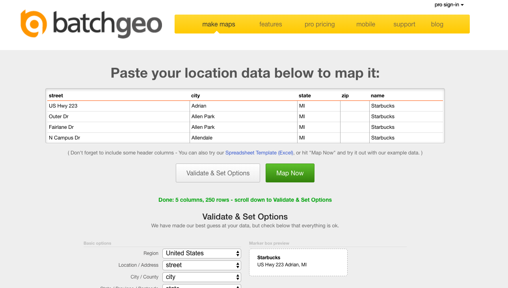
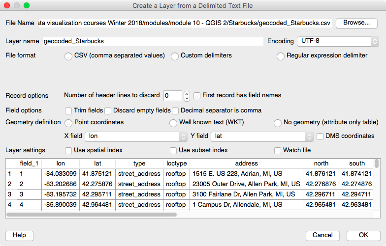

```{r setup, include=FALSE}

# library(tufte)

knitr::opts_chunk$set(echo = TRUE,
                      warning = FALSE,
                      message = FALSE,
                      fig.margin = TRUE) 

```

# Background

*geocoding* is the process of **turning addresses into latitudes and longitudes** that can then be read into GIS or mapping software.

* In *ArcGIS*, proprietary GIS software, geocoding is a built in function, albeit one depending on access to a separate licensed database.  This may be the best choice for especially sensitive data.
* With *open source software* solutions are constantly changing, and depend on *some creativity*.
* As always with all data, and perhaps especially with *GIS data*, one needs to think carefully about respondent confidentiality.

> **Does sharing a respondent's address with a geocoding server potentially compromise a respondent's safety or security?**

# Workflow

```{r, eval=TRUE, echo=FALSE}

library(DiagrammeR)

grViz("

digraph mygraph {

  # a 'graph' statement

  graph [overlap = true, fontsize = 10, rankdir = LR]

  # several 'node' statements

  node [shape = box,
        fontname = Helvetica]
 
  # several 'edge' statements 

  addresses -> geocode

  geocode -> web_geocoding

  web_geocoding -> KML

  KML -> QGIS

  geocode -> R_geocoding 

  R_geocoding -> R_map

  R_geocoding -> save_data_as_csv

  save_data_as_csv -> QGIS
}
")

```

# Web Solution (limit 250 addresses)

[batchgeo.com](https://batchgeo.com/) is one of several websites that will geocode addresses.

**batchgeo.com** has a limit of **250** addresses.

Geocoded data can be saved as *KML*, Google Earth's format, which can then be read into QGIS: [http://support.batchgeo.com/customer/en/portal/articles/1457646-exporting-map-data](http://support.batchgeo.com/customer/en/portal/articles/1457646-exporting-map-data)




# Data Wrangling

## Concatenate Addresses

Address processing across GIS is constantly evolving.  

* The *old standard* still used in *ArcGIS* was that you needed *separate fields* for *street address*, *city*, *state* and *ZIP*
* The *new standard* is that all of these fields should be merged together, though separated by commas.

> **Do your addresses need to be concatenated?**
> **Do your addresses need to be separated?**

# Simple Map in R

```{r, echo=TRUE, eval=TRUE}

load("geocoded_Starbucks.Rdata")

```

Here is what this data looks like:

```{r, echo=FALSE, eval=TRUE}

library(pander)

pander(head(geocoded_Starbucks))

```

```{r, fig.cap="Map Using library(maps)"}

library(maps)

map("state",
    regions = "michigan")

# base R for adding points to pre-existing graph

points(geocoded_Starbucks$lon, 
       geocoded_Starbucks$lat,
       pch = 19, # Point CHaracter
       col = "forestgreen") 

title("Starbucks Locations in Michigan")

```

```{r, echo=FALSE}

write.csv(geocoded_Starbucks,
          file = "geocoded_Starbucks.csv")

```

# QGIS Map




# Questions?
