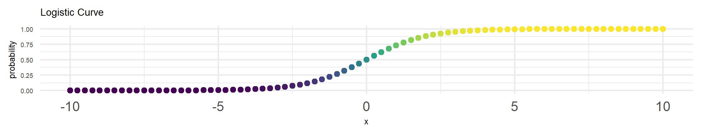

New stuff for a course on *Categorical Data Analysis* that is going to get moved somewhere else at some point.

> These slides and handouts are free to share and download as long as you cite their source.

* [A Review of Descriptive Statistics, OLS and an Introduction to Stata](https://agrogan1.github.io/newstuff/categorical/review-stats-intro-stata/review-stats-intro-stata-slidy.html) [[PDF](https://agrogan1.github.io/newstuff/categorical/review-stats-intro-stata/review-stats-intro-stata.pdf)]
* [Data Visualization With Stata](https://agrogan1.github.io/newstuff/data-visualization-with-Stata/data-visualization-with-Stata-slidy.html) [[PDF](https://agrogan1.github.io/newstuff/data-visualization-with-Stata/data-visualization-with-Stata.pdf)]
* [Contingency Tables](https://agrogan1.github.io/newstuff/categorical/contingency-tables/contingency-tables-slidy.html) [[PDF](https://agrogan1.github.io/newstuff/categorical/contingency-tables/contingency-tables.pdf)]
    + [Risks and Odds](https://agrogan1.github.io/newstuff/categorical/risks-and-odds/risks-and-odds.html) [[PDF](https://agrogan1.github.io/newstuff/categorical/risks-and-odds/risks-and-odds.pdf)]
* [Logistic Regression](https://agrogan1.github.io/newstuff/categorical/logistic-regression/logistic-regression-slidy.html) [[PDF](https://agrogan1.github.io/newstuff/categorical/logistic-regression/logistic-regression.pdf)]
    + [Generalized Linear Models](https://agrogan1.github.io/newstuff/categorical/glm/glm.html) [[PDF](https://agrogan1.github.io/newstuff/categorical/glm/glm.pdf)] [[A Gallery of Distributions Used in GLM's](https://agrogan1.github.io/newstuff/categorical/glm/glm-gallery.html)]
    + [Interactions in Logistic Regression](https://agrogan1.github.io/newstuff/categorical/logistic-interactions-2/logistic-interactions-2.html) [[PDF](https://agrogan1.github.io/newstuff/categorical/logistic-interactions-2/logistic-interactions-2.pdf)]
    + [Complete Separation](https://agrogan1.github.io/newstuff/categorical/logistic-regression/complete-separation.html) [[PDF](https://agrogan1.github.io/newstuff/categorical/logistic-regression/complete-separation.pdf)]
* [Ordinal and Multinomial Logistic Regression](https://agrogan1.github.io/newstuff/categorical/ordinal-multinomial-logistic-regression/ordinal-multinomial-logistic-regression-slidy.html) [[PDF](https://agrogan1.github.io/newstuff/categorical/ordinal-multinomial-logistic-regression/ordinal-multinomial-logistic-regression.pdf)]
* [Count Regression Models](https://agrogan1.github.io/newstuff/categorical/count-regression/count-regression-slidy.html) [[Word](https://agrogan1.github.io/newstuff/categorical/count-regression/count-regression.docx)]
* [Propensity Score Models](https://agrogan1.github.io/newstuff/causal-modeling/causal-modeling.html) [[PDF](https://agrogan1.github.io/newstuff/causal-modeling/causal-modeling.pdf)] (as part of a larger set of materials on *causal modeling*). 
* [Bayesian Categorical Data Analysis](https://agrogan1.github.io/newstuff/categorical/Bayes/Bayes-slidy.html) [[PDF](https://agrogan1.github.io/newstuff/categorical/Bayes/Bayes.pdf)]
    + [Bayes Theorem Applied To Data Analysis](https://agrogan1.github.io/newstuff/Bayes-theorem/Bayes-theorem.html)
* [Survival Analysis And Event History](https://agrogan1.github.io/newstuff/categorical/survival-analysis-and-event-history/survival-analysis-and-event-history-slidy.html) [[PDF](https://agrogan1.github.io/newstuff/categorical/survival-analysis-and-event-history/survival-analysis-and-event-history.pdf)]
    + [Times, Events And Censoring](https://agrogan1.github.io/newstuff/categorical/survival-analysis-and-event-history/times-events-and-censoring.html)

Andrew Grogan-Kaylor ([GitHub](https://agrogan1.github.io/), [New GitHub](https://agrogan1.github.io/newstuff)) | [agrogan@umich.edu](agrogan@umich.edu)

