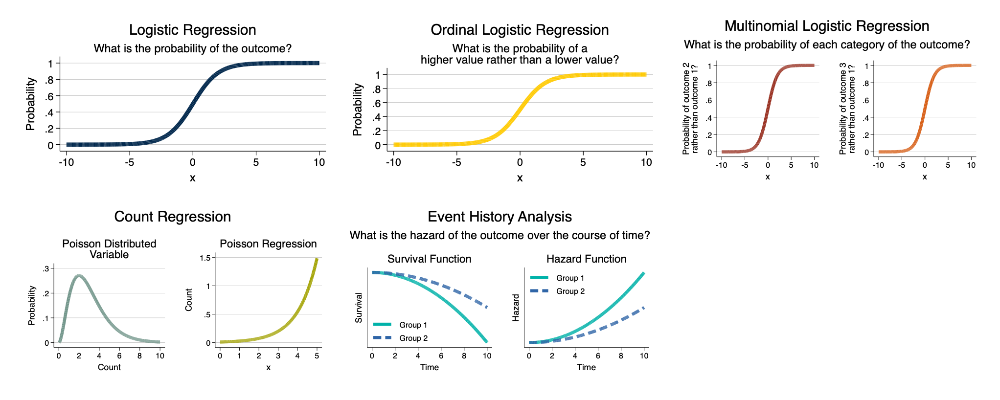

New stuff for a course on *Categorical Data Analysis* that is going to get moved somewhere else at some point.

> These slides and handouts are free to share and download as long as you cite their source.

> **Not everything below is covered in the course itself, but the list below serves as a rough *roadmap* guide to the course.**

* [A Review of Descriptive Statistics, OLS and an Introduction to Stata](https://agrogan1.github.io/newstuff/categorical/review-stats-intro-stata/review-stats-intro-stata-slidy.html) [[PDF](https://agrogan1.github.io/newstuff/categorical/review-stats-intro-stata/review-stats-intro-stata.pdf)]
* [Data Visualization With Stata](https://agrogan1.github.io/Stata/data-visualization-with-Stata/data-visualization-with-Stata-slidy.html) [[PDF](https://agrogan1.github.io/Stata/data-visualization-with-Stata/data-visualization-with-Stata.pdf)]
* [Contingency Tables](https://agrogan1.github.io/newstuff/categorical/contingency-tables/contingency-tables-slidy.html) [[PDF](https://agrogan1.github.io/newstuff/categorical/contingency-tables/contingency-tables.pdf)]
    + [Risks and Odds](https://agrogan1.github.io/newstuff/categorical/risks-and-odds/risks-and-odds.html) [[PDF](https://agrogan1.github.io/newstuff/categorical/risks-and-odds/risks-and-odds.pdf)] [[Interactive Version](https://agrogan1.github.io/newstuff/categorical/risks-and-odds-2/risks-and-odds-2.html)]
    + [Describing Odds Ratios](https://agrogan1.github.io/newstuff/categorical/describing-odds-ratios/describing-odds-ratios.html) [[PDF](https://agrogan1.github.io/newstuff/categorical/describing-odds-ratios/describing-odds-ratios.pdf)]
    + [Simpson's Paradox in Contingency Tables](https://agrogan1.github.io/newstuff/categorical/simpsons-paradox-hospital-data/simpsons-paradox-hospital-data.html) [[PDF](https://agrogan1.github.io/newstuff/categorical/simpsons-paradox-hospital-data/simpsons-paradox-hospital-data.pdf)]
    + [Visualizing Categorical Data](https://agrogan1.github.io/newstuff/categorical/visualizing-categorical-data/visualizing-categorical-data.html) [[PDF](https://agrogan1.github.io/newstuff/categorical/visualizing-categorical-data/visualizing-categorical-data.pdf)]
* [Logistic Regression](https://agrogan1.github.io/newstuff/categorical/logistic-regression/logistic-regression-slidy.html) [[PDF](https://agrogan1.github.io/newstuff/categorical/logistic-regression/logistic-regression.pdf)]
    + [Some Stuff About Logarithms](https://agrogan1.github.io/newstuff/categorical/logarithms-some-stuff/logarithms-some-stuff.html)
    + [A Diagram Of Some Basic "Intuitions" About The Logistic Curve](https://agrogan1.github.io/newstuff/categorical/logistic-curve-intuitions.pdf)
    + [Logistic Regression: The Basics](https://agrogan1.github.io/newstuff/categorical/logistic-regression-the-basics/logistic-regression-the-basics.html) [[PDF](https://agrogan1.github.io/newstuff/categorical/logistic-regression-the-basics/logistic-regression-the-basics.pdf)]
     + [Maximum Likelihood Estimation](https://agrogan1.github.io/teaching/likelihood-and-log-likelihood/likelihood-and-log-likelihood.html)
     + [Changes In Predicted Probabilities Are Different At Different Values Of The Independent Variables](https://agrogan1.github.io/newstuff/categorical/logistic-regression-and-predicted-probabilities/logistic-regression-and-predicted-probabilities.pdf) 
    + [Predicted Probabilities and Margins](https://agrogan1.github.io/newstuff/categorical/predict-and-margins/predict-and-margins.html) [[PDF](https://agrogan1.github.io/newstuff/categorical/predict-and-margins/predict-and-margins.pdf)] [[A Substantive Example](https://agrogan1.github.io/newstuff/categorical/predict-and-margins-substantive-example/predict-and-margins-substantive-example.html) [[PDF](https://agrogan1.github.io/newstuff/categorical/predict-and-margins-substantive-example/predict-and-margins-substantive-example.pdf)]]
    + [More Thoughts on Odds and Probabilities](https://agrogan1.github.io/newstuff/categorical/logistic-more-thoughts/logistic-more-thoughts.html) [[PDF](https://agrogan1.github.io/newstuff/categorical/logistic-more-thoughts/logistic-more-thoughts.pdf)]
    + [Interactions in Logistic Regression](https://agrogan1.github.io/newstuff/categorical/logistic-interactions-2/logistic-interactions-2.html) [[PDF](https://agrogan1.github.io/newstuff/categorical/logistic-interactions-2/logistic-interactions-2.pdf)]
    + [Logistic Regression Models Are Inherently Interactive](https://agrogan1.github.io/newstuff/categorical/logistic-inherently-interactive/logistic-inherently-interactive.html) [[PDF](https://agrogan1.github.io/newstuff/categorical/logistic-inherently-interactive/logistic-inherently-interactive.pdf)]
    + [Generalized Linear Models](https://agrogan1.github.io/newstuff/categorical/glm/glm.html) [[PDF](https://agrogan1.github.io/newstuff/categorical/glm/glm.pdf)] [[A Gallery of Distributions Used in GLM's](https://agrogan1.github.io/newstuff/categorical/glm/glm-gallery.html)]
    + [Coefficients in Logistic Regression Models](https://agrogan1.github.io/newstuff/categorical/logistic-and-covariates/logistic-and-covariates.html) [[PDF](https://agrogan1.github.io/newstuff/categorical/logistic-and-covariates/logistic-and-covariates.pdf)]
    + [Complete Separation](https://agrogan1.github.io/newstuff/categorical/logistic-regression/complete-separation.html) [[PDF](https://agrogan1.github.io/newstuff/categorical/logistic-regression/complete-separation.pdf)] 
    + [Adding Non-Linearity To The Right Hand Side Of An Equation for Categorical Data](https://agrogan1.github.io/newstuff/categorical/adding-non-linearity-to-right-hand-side/adding-non-linearity-to-right-hand-side.html)
    + [Some Thoughts on Very Large Constants and Coefficients in Non-Linear Models](https://agrogan1.github.io/newstuff/categorical/very-large-constants-ORs-RRs-IRRs.html)
* [Ordinal and Multinomial Logistic Regression](https://agrogan1.github.io/newstuff/categorical/ordinal-multinomial-logistic-regression/ordinal-multinomial-logistic-regression-slidy.html) [[PDF](https://agrogan1.github.io/newstuff/categorical/ordinal-multinomial-logistic-regression/ordinal-multinomial-logistic-regression.pdf)]
    + [Cutpoints in Ordinal Logistic Regression](https://agrogan1.github.io/newstuff/categorical/ordinal-logistic-cutpoints/ordinal-logistic-cutpoints.html) [[PDF](https://agrogan1.github.io/newstuff/categorical/ordinal-logistic-cutpoints/ordinal-logistic-cutpoints.pdf)]
* [Count Regression Models](https://agrogan1.github.io/newstuff/categorical/count-regression/count-regression-slidy.html) [[Word](https://agrogan1.github.io/newstuff/categorical/count-regression/count-regression.docx)]
    + [Poisson for Binary Outcomes](https://agrogan1.github.io/newstuff/categorical/poisson-for-binary-outcomes/poisson-for-binary-outcomes.html)
    + [Comparing Statistical Models](https://agrogan1.github.io/newstuff/categorical/comparing-models/comparing-models.html) [[PDF](https://agrogan1.github.io/newstuff/categorical/comparing-models/comparing-models.pdf)]
* [Multilevel Models For Categorical Data](https://agrogan1.github.io/newstuff/categorical/multilevel/multilevel-slidy.html) [[PDF](https://agrogan1.github.io/newstuff/categorical/multilevel/multilevel.pdf)]
* [Bayesian Categorical Data Analysis](https://agrogan1.github.io/newstuff/categorical/Bayes/Bayes-slidy.html) [[PDF](https://agrogan1.github.io/newstuff/categorical/Bayes/Bayes.pdf)]
    + A *kinda new*, *kinda old* resource: [Thinking Through Bayesian Ideas](https://agrogan.shinyapps.io/Thinking-Through-Bayes/)
    + [Bayes Theorem Applied To Data Analysis](https://agrogan1.github.io/newstuff/Bayes-theorem/Bayes-theorem.html)
    + [Accepting The Null Hypothesis](https://agrogan1.github.io/Bayes/accepting-H0/accepting-H0.html)
* [Survival Analysis And Event History](https://agrogan1.github.io/newstuff/categorical/survival-analysis-and-event-history/survival-analysis-and-event-history-slidy.html)  [[PDF](https://agrogan1.github.io/newstuff/categorical/survival-analysis-and-event-history/survival-analysis-and-event-history.pdf)]
    + [Times, Events And Censoring](https://agrogan1.github.io/newstuff/categorical/survival-analysis-and-event-history/times-events-and-censoring.html)
    + [Reformatting Longitudinal Data As Survival Data](https://agrogan1.github.io/newstuff/categorical/survival-analysis-and-event-history/simulated-survival-data.html)
    + [Cox Proportional Hazards Model](https://agrogan1.github.io/newstuff/categorical/survival-analysis-and-event-history/Cox-proportional-hazards-model-slidy.html) [[PDF](https://agrogan1.github.io/newstuff/categorical/survival-analysis-and-event-history/Cox-proportional-hazards-model.pdf)]
    + [Survival Analysis With Roman Emperors Data](https://agrogan1.github.io/newstuff/categorical/survival-analysis-and-event-history/emperors/emperors.html)
    + [Cox Proportional Hazards Model With Time Varying Covariates](https://agrogan1.github.io/newstuff/categorical/survival-analysis-Cox-TVC/survival-analysis-Cox-TVC.html) [[PDF](https://agrogan1.github.io/newstuff/categorical/survival-analysis-Cox-TVC/survival-analysis-Cox-TVC.pdf)]
    + [More on the Cox Proportional Hazards Model](https://agrogan1.github.io/newstuff/categorical/survival-more-on-Cox-model/survival-more-on-Cox-model.html) [[PDF](https://agrogan1.github.io/newstuff/categorical/survival-more-on-Cox-model/survival-more-on-Cox-model.pdf)]

Andrew Grogan-Kaylor ([GitHub](https://agrogan1.github.io/), [New GitHub](https://agrogan1.github.io/newstuff)) | [agrogan@umich.edu](agrogan@umich.edu)

