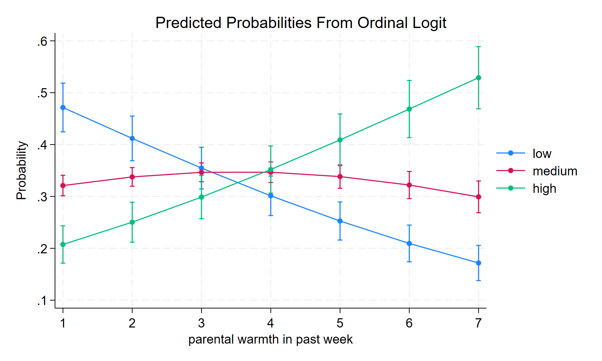

# Ordinal Logistic Regression

[ordinal-multinomial-logistic-regression-2.pdf](ordinal-multinomial-logistic-regression-2.pdf) is the original document on ordinal and multinomial logistic regression.

[building-your-own-Brant-test.do](https://github.com/agrogan1/newstuff/blob/master/categorical/ordinal-multinomial-logistic-regression-2/building-your-own-Brant-test.do) is an example of *building your own* Brant test when the user written `brant` command does not work. **NB:** This is complicated to implement!!!

[bettermarginsplot.do](bettermarginsplot.do) is an experiment with using the undocumented `,saving(...)` option of `margins` to save the `margins` data to a new file that we can then use for graphing. Example plots are below. 

