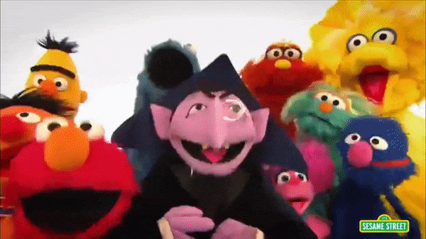

```{r setup, include=FALSE}
knitr::opts_chunk$set(echo = TRUE)
```

# Introduction

Placing images in RMarkdown documents can be *difficult*. Here are two approaches.

# Method 1

> Easiest if image is in same directory as your RMarkdown file.

Here I use the code:

``



## Method 1A (add width)

`{ width=20% }`

> Note the space before and after the `{` and `}`.

{ width=20% }

# Method 2

This method uses code in an R chunk. You could set `echo = FALSE` to hide this chunk in the final RMarkdown document.

I use the `outwidth =` option to set the size of the image: `{r out.width = "20%"}`

```{r out.width = "20%"}


```


