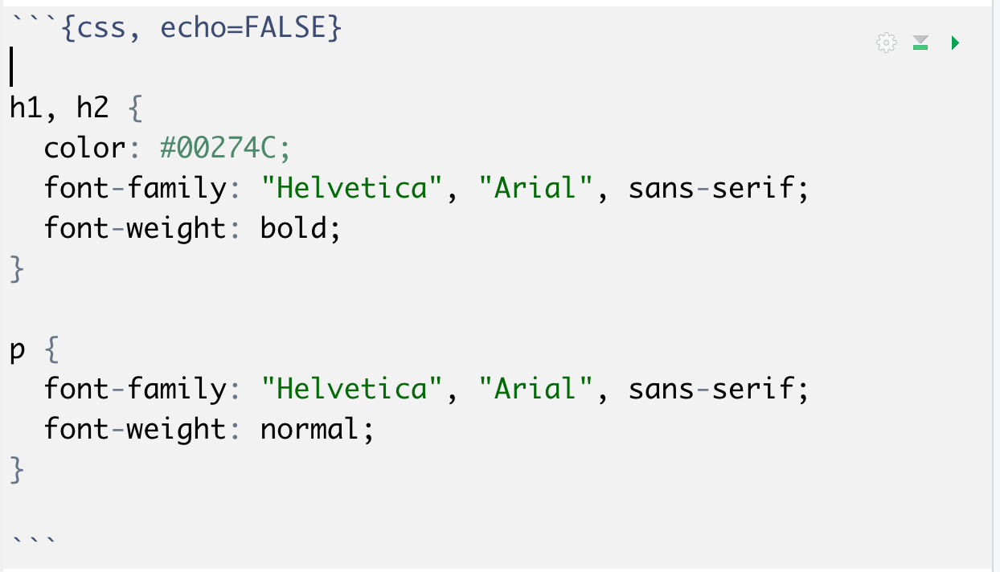

```{r setup, include=FALSE}

knitr::opts_chunk$set(echo = TRUE)

```

```{css, echo=FALSE}

h1, h2 {
  color: #00274C;
  font-family: "Helvetica", "Arial", sans-serif; 
  font-weight: bold;
}

p {
  font-family: "Helvetica", "Arial", sans-serif; 
  font-weight: normal;
}

```

# Background

*CSS* (*Cascading Style Sheets*) are a way to change the style, including fonts, of HTML pages. CSS is a *vast* topic, but *a little bit of CSS can go a long way*.

Fortunately also, CSS can be directly embedded into RMarkdown with a *CSS block*.

# Some Very Basic HTML

* Headers
    + h1: Level 1
    + h2: Level 2
    + h3: Level 3
    + etc...
* p: *paragraph* (body text) style

# Example CSS Block

Here is the CSS block that controls the formatting of this document:

> Note how the block begins with ` ```{css} ` rather than ` ```{r}`.

```{r, echo=FALSE}



```

# More CSS

Here is [one of my CSS files](UM.css) that attempts to replicate official UM Colors.


    
    
    